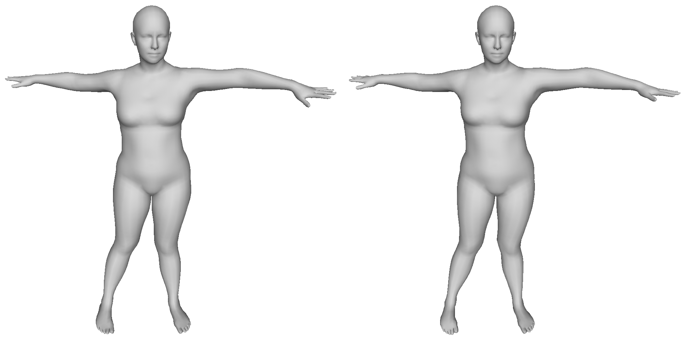
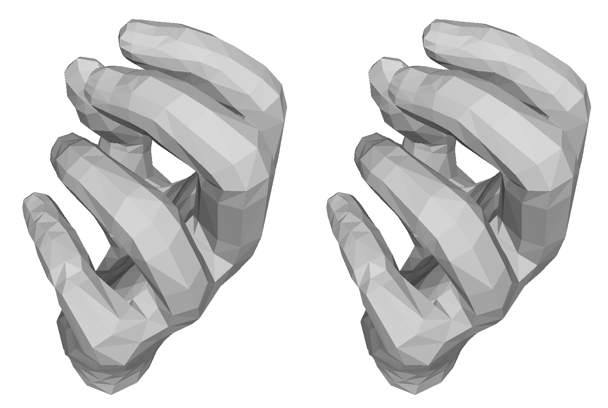

# 备注

这一部分可以不用看，是滑铁卢的初次实验

fork 自项目 [Minimal-IK](https://github.com/CalciferZh/Minimal-IK)

尝试将 FBX 文件的关节点信息直接导出，并使用 MiniIK 直接计算 SMPL 参数

但实际测试结果见Issue：[想请教一下SMPL参数估计的正确食用方式（扶](https://github.com/CalciferZh/Minimal-IK/issues/18)

相关测试代码见 json2smpl.ipynb

# Minimal-IK

A simple and naive inverse kinematics solver for MANO hand model, SMPL body model, and SMPL-H body+hand model.

Briefly, given joint coordinates (and optional other keypoints), the solver gives the corresponding model parameters.

Levenberg–Marquardt algorithm is used, the energy is simply the L2 distance between the keypoints.

As no prior nor regularization terms are used, it is not surprising that the code does not work well on "real" data. My intention to release the code was to give some hints on how to develope a customized IK solver. I would recommend to add more complicating terms for better performance.

## Results

### Qualitative

This is the example result on the SMPL body model.
The left is the ground truth, and the right one is the estimation.
You can notice the minor difference between the left hands.

Below is the example result of the MANO hand model.
Left for ground truth, and right for estimation.

### Quantitative

We test this approach on the [AMASS dataset](https://amass.is.tue.mpg.de/).

|             | Mean Joint Error (mm) | Mean Vertex Error (mm) |
| ----------  | --------------------- | ---------------------- |
| SMPL (body) | 14.406                | 23.110                 |
| MANO (hand) | 2.15                  | 3.42                   |

We assume that the global rotation is known.
We discuss this further in the `Customization Notes` section.

## Usage

### Models

1. Download the official model from MPI.
2. See `config.py` and set the official model path.
3. See `prepare_model.py`, use the provided function to pre-process the model.

### Solver

1. See `example.py`, un-comment the corresponding code.
2. `python example.py`.
3. The example ground truth mesh and estimated mesh are saved to `gt.obj` and `est.obj` respectively.

### Dependencies

Every required package is available via `pip install`.

### Customization Notes

Again, we note that this approach cannot handle large global rotations (R0) due to the high non-convexity.
For example, when the subject keeps the T pose but faces backwards.

In such cases, a good initialization, at least for R0, is necessary.

We also note that this approach is sensitive the the scale (i.e. length unit), as it would affect the MSE and the update step.
Please consider using the default scale if you do not have special reasons.

## Credits

* @yxyyyxxyy for the quantitative test on the AMASS dataset.
* @zjykljf for the starter code of the LM solver.